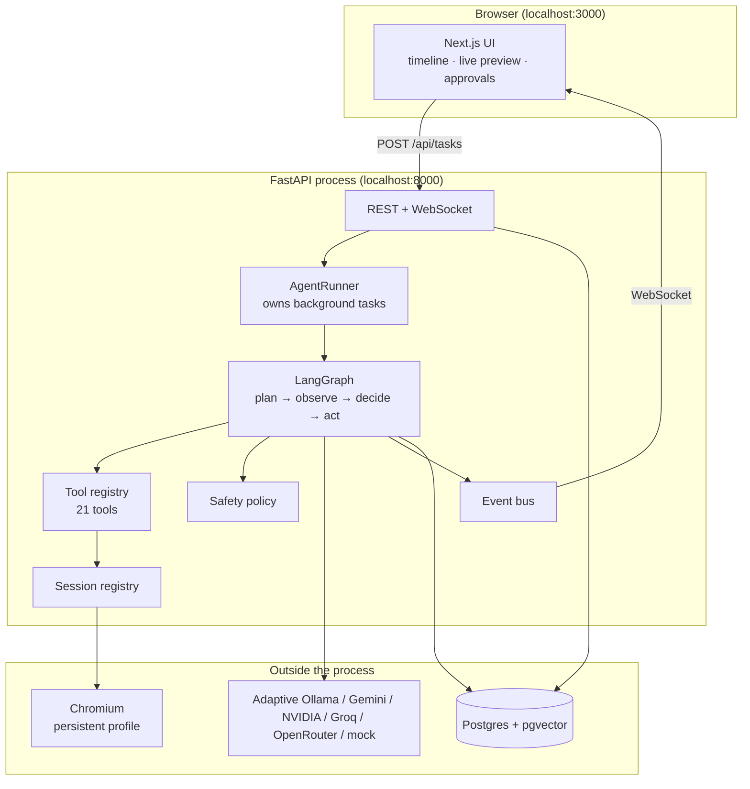
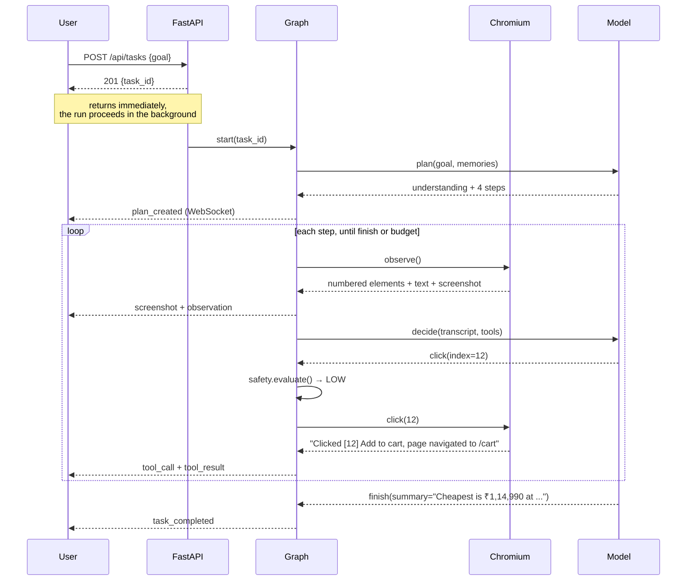
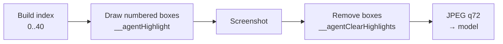
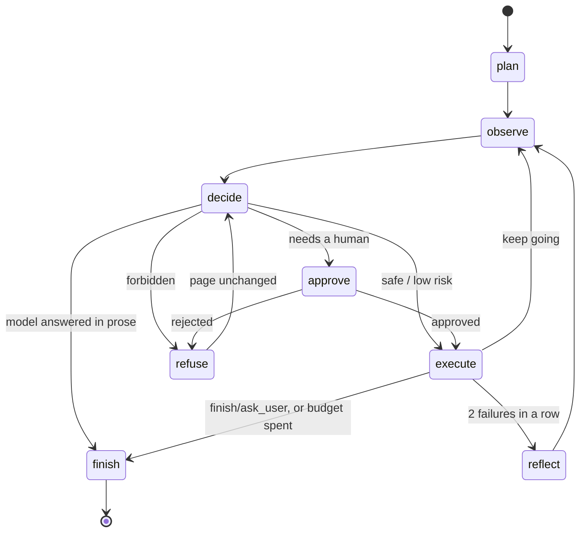
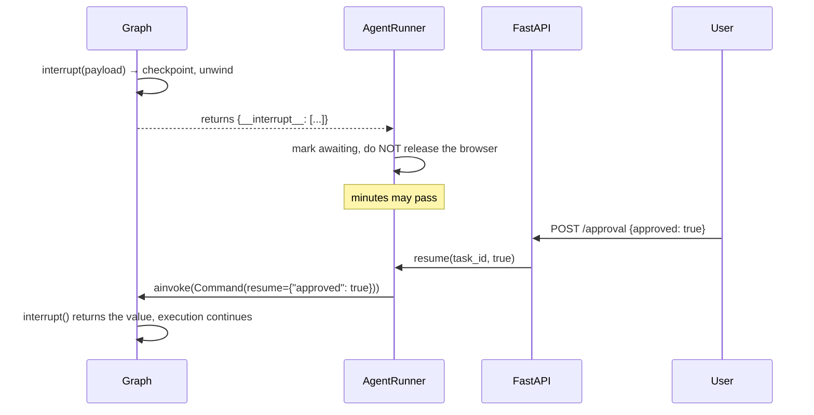
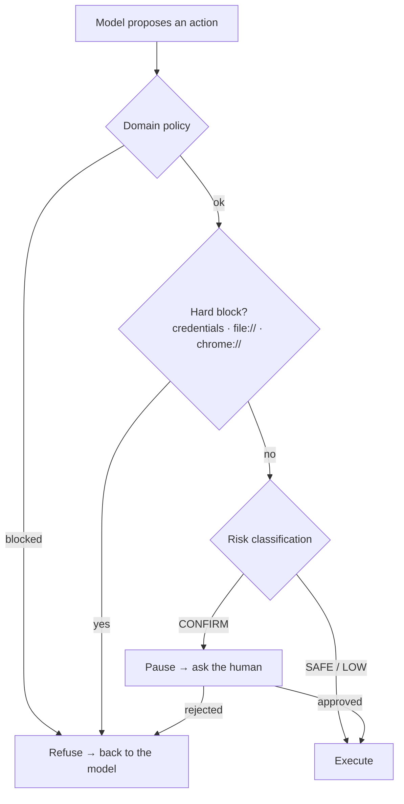
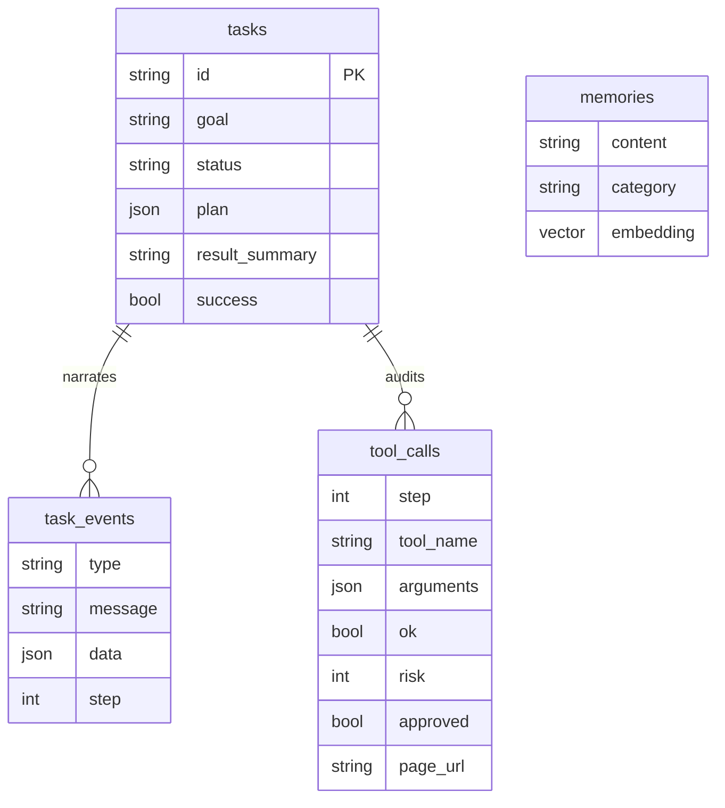

# Architecture

This document explains how the browser agent works, from the shape of the whole
system down to the decisions that are easy to get wrong. It is written to be
read top to bottom once, then dipped into.

- [1. What the system is](#1-what-the-system-is)
- [2. System overview](#2-system-overview)
- [3. The life of a task](#3-the-life-of-a-task)
- [4. Component map](#4-component-map)
- [Deep dive A: Perception](#deep-dive-a-perception--how-the-agent-sees-a-page)
- [Deep dive B: The agent loop](#deep-dive-b-the-agent-loop)
- [Deep dive C: Human-in-the-loop](#deep-dive-c-human-in-the-loop)
- [Deep dive D: Safety](#deep-dive-d-safety)
- [Deep dive E: Context economics](#deep-dive-e-context-economics)
- [Deep dive F: The tool layer](#deep-dive-f-the-tool-layer)
- [Deep dive G: The LLM boundary](#deep-dive-g-the-llm-boundary)
- [Deep dive H: Persistence and memory](#deep-dive-h-persistence-and-memory)
- [Deep dive I: Event streaming](#deep-dive-i-event-streaming)
- [Deep dive J: Browser sessions and profiles](#deep-dive-j-browser-sessions-and-profiles)
- [5. Failure modes](#5-failure-modes)
- [6. Cost and performance](#6-cost-and-performance)
- [7. Security posture](#7-security-posture)
- [8. Scaling past one process](#8-scaling-past-one-process)
- [9. Limitations](#9-limitations)

---

## 1. What the system is

A person describes a task in plain language. The system plans an approach,
drives a real Chromium browser to carry it out, pauses to ask before doing
anything irreversible, and reports back what it found.

Four principles shaped every decision below.

**The model decides; Python enforces.** The LLM chooses *what* to do. Whether
that action is permitted, whether it needs a human, and what actually happens to
the browser are all decided by deterministic code. A model can be argued into
believing a purchase is safe; a regular expression cannot.

**Failure is data, not an exception.** Clicks miss, elements vanish, pages hang.
None of these end a run. They come back to the model as readable text so it can
try something else — the model is the component best placed to recover.

**Degrade, do not block.** No API key? A mock provider runs the whole system. No
database? Task history moves to memory and everything keeps working. A missing
dependency should cost a feature, not the tool.

**Make the agent legible.** A browser agent is opaque by nature — pages flash
past faster than anyone can follow. Every thought, action and result is streamed
and stored, and every screenshot carries the same element numbers the model
reasons about, so a person can check the agent's story against the evidence.

---

## 2. System overview



The whole backend is **one process**. Nothing is queued, brokered or sharded.
That is a deliberate fit to the actual workload: a browser agent is
human-paced — a handful of model calls per minute, one browser per task — and
distributing it would add far more operational surface than it removes latency.
[Section 8](#8-scaling-past-one-process) covers what changes if that stops
being true.

**Chromium runs on the host, not in a container.** Debugging a browser agent
means *watching* the browser: which element it clicked, what the modal said, why
the page did not load. Headless-in-Docker takes that away. Postgres is
containerised because nobody needs to watch a database.

---

## 3. The life of a task

Following `"Find the cheapest RTX 5070 laptop under ₹1.2L"` from typing to
answer:



Two things in that diagram carry most of the design.

**Observation happens before every decision, never after an action.** The model
always reasons over a page rendering taken moments earlier, so the element
numbers it uses are current. The obvious alternative — act, then decide from the
previous observation — is the single most common source of the "element not
found" death spiral in agents like this.

**The HTTP request returns before the work starts.** Tasks run for minutes.
Holding a request open for that would make every timeout in the stack a
correctness problem. The task id is the handle; the WebSocket is the channel.

---

## 4. Component map

```
backend/app/
├── agent/              The orchestration layer
│   ├── graph.py          Node wiring and all routing decisions
│   ├── state.py          What flows between nodes
│   ├── runtime.py        Services the nodes need but state must not hold
│   ├── runner.py         Background tasks, pause/resume, cancellation
│   ├── prompts.py        Every prompt, in one readable file
│   ├── parsing.py        Tolerant JSON extraction from model output
│   └── nodes/            plan · observe · decide · approve · execute · reflect · finish
│
├── browser/            Perception and action
│   ├── js/build_dom_index.js   The injected indexer — the agent's eyes
│   ├── session.py        One persistent Chromium profile
│   ├── observation.py    The structured snapshot the model reasons over
│   ├── actions.py        The browser verbs
│   └── registry.py       task_id → live session
│
├── tools/              The model's vocabulary (21 tools)
├── llm/                Provider-agnostic interface + Gemini + OpenAI-compatible providers + mock
├── safety/policy.py    What needs approval, what is forbidden
├── memory/store.py     Long-term facts, over pgvector
├── db/                 Task history and audit trail
├── events/             The narration bus
└── api/                REST + WebSocket
```

The dependency direction is strictly inward: `api` → `agent` → `tools` →
`browser`/`llm`/`memory`. Nothing in `browser/` knows an agent exists; nothing
in `llm/` knows what a tool is. That is what makes the fake browser in
`tests/conftest.py` a five-minute exercise rather than a mocking framework.

---

## Deep dive A: Perception — how the agent sees a page

This is the heart of the system. Almost every hard bug in a browser agent is a
perception bug.

### The problem

A model cannot act on a page it cannot address. Three approaches exist, and two
of them are traps.

| Approach | Why it fails |
|---|---|
| Give the model raw HTML | A shopping page is 500KB of nested divs. Enormous, mostly irrelevant, and blows the context budget in one step. |
| Have the model write CSS selectors | `.sc-x7f2a9` is a build artefact that changes on every deploy. The model writes plausible selectors that match nothing. |
| Screenshots alone | The model can *see* the button but has no way to name it. "Click the blue one on the right" is not an API. |

### The solution: a numbered index

`build_dom_index.js` is injected into every frame and walks the DOM in document
order, producing a compact rendering where every interactive element carries an
integer:

```
Gaming laptops
[0]<input placeholder="Search" type="text"></input>
[1]<button>Search</button>
ASUS ROG Strix G16 - RTX 5070
₹1,14,990
[2]<a href="/dp/B0F...">See product details</a>
[3]<button aria-label="Add ASUS ROG Strix to cart">Add to cart</button>
```

The model replies `click(index=3)`. That integer is the *entire* interaction
contract, and it buys three things:

- **Resilience.** Obfuscated class names are irrelevant. The index is derived
  from what is on screen right now.
- **Compactness.** A page that is 500KB of HTML becomes a few KB of text.
- **Groundedness.** The model can only reference elements that actually exist,
  are visible, and are clickable. It cannot hallucinate a "Checkout" button onto
  a page that has none.

### What counts as interactive

Native tags (`button`, `a`, `input`, `select`, …) are the easy half. The rest of
the web is not so tidy, so the walker also accepts ARIA roles, `contenteditable`,
`onclick` handlers, non-negative `tabindex`, and — as a last resort —
`cursor: pointer` on a leaf-ish node, which is how a great many sites build
buttons out of `<div>`s.

That last rule is restricted to elements with at most three element children.
Without the restriction, a clickable product card indexes itself *and* every
element inside it, and the model has to guess which of five overlapping indices
means "open this product".

### Visibility is not enough — the hit test matters

An element can be perfectly visible in the DOM and still be unclickable, because
something is on top of it. Cookie banners, newsletter modals and sticky headers
do this constantly.

```js
const hit = root.elementFromPoint(centreX, centreY);
return hit === el || el.contains(hit) || hit.contains(el);
```

Every candidate is hit-tested at its centre point. If the click would land on
something else, the element is not indexed at all. This is what prevents the
classic failure loop:

> `click(12)` → *"element intercepts pointer events"* → model retries →
> same error → model retries → budget exhausted

The model never sees index 12 while the modal is up. It sees the modal's
"Accept" button instead, dismisses it, and the page underneath becomes
addressable. The test `test_covered_elements_are_not_indexed` pins this.

### Shadow DOM and iframes: a deliberate split

The two are handled in different places, for a reason.

**Shadow roots are walked in JavaScript.** They are same-document, invisible to
`querySelectorAll`, and entirely real to a user. The walker descends into
`el.shadowRoot` before ordinary children.

**Iframes are *not* walked in JavaScript.** Same-origin traversal would work;
cross-origin traversal is impossible from the page. Playwright, however, exposes
every frame regardless of origin. So the Python side runs the indexer once per
frame and merges the results, passing a `startIndex` so numbering stays globally
unique:

```
main frame   → indices 0..40   (startIndex 0)
iframe #1    → indices 41..47  (startIndex 41)
```

Each element remembers `(frame_index, local_index)`, which is what lets
`session.resolve()` hand back a live Playwright handle from the frame the
element actually lives in:

```python
frame = page.frames[element.frame_index]
handle = await frame.evaluate_handle("i => window.__agentElements[i]", element.local_index)
```

### The vision fallback

The text rendering is right most of the time and cheap always. But it is blind
to canvas-rendered apps, image-only buttons, and pages whose meaning is carried
by layout.

So a screenshot is **always captured** (the human watching needs it) but only
**attached to the prompt** when text is demonstrably failing. In `auto` mode,
that is when:

- the page yielded fewer than 4 interactive elements, or under 300 characters —
  what a canvas app, a CAPTCHA, or a still-loading page looks like from the
  DOM's point of view; or
- the previous action failed, so the model's text-based picture of the page has
  already been proven wrong.

When a screenshot is attached, it is **annotated with the same numbers**:



This is the "set of marks" technique, and the annotation is what makes the image
*actionable* rather than merely informative: the model reads a number off the
picture and passes it straight to `click`. Text and image describe the same
world with the same names.

Cost matters here. A 1440×900 JPEG is roughly 1,000–1,500 tokens. Sending one
every step on a 40-step task is ~50k tokens of images — on a free Gemini tier,
that is the fastest route to a rate limit. `auto` typically spends it on 10–20%
of steps.

### Credential hygiene in the indexer

Anything the indexer emits reaches the model. `isSecret()` gates three separate
paths that could each leak a password — the attribute dump, the `current=` hint,
and the label fallback chain. The third is the subtle one: an unlabelled
`<input type="password">` would otherwise be *described by its own contents*.
Four parametrised tests cover it, and one of them is there because that exact
leak existed during development.

---

## Deep dive B: The agent loop

### The graph



Three routing choices define the agent's character:

**`refuse` returns to `decide`, not to `observe`.** A blocked action never
touched the page, so re-reading it would spend a step and a screenshot to learn
nothing.

**`reflect` sits between `execute` and `observe`.** Revised direction lands in
the transcript *before* the model next looks at the page.

**Only one action per step.** A model that proposes three calls at once has not
seen the result of the first, so the rest are speculation. Only `tool_calls[0]`
is taken.

### State discipline

`AgentState` describes the run; it never owns resources. This is not tidiness —
it is forced by checkpointing. The graph must be serialisable so a run can pause
for approval and resume later, and a live Chromium connection is the opposite of
serialisable. So state holds a `task_id` string, and nodes look the browser up in
`SessionRegistry`.

The important field is `messages`: the plan, every observation, every tool call
and every result, in order. The quality of the agent is largely the quality of
what ends up in that list.

### Why plan at all?

The act loop could just start clicking. Two things break without a plan:

- **Multi-source tasks.** *"Compare MacBook prices on Amazon and Flipkart"*
  requires remembering there is a second site after finishing the first. A plan
  in the transcript is what carries that intent across fifteen steps.
- **Cheap misunderstanding detection.** One fast-model call surfaces a misread
  request before fifteen browser steps go the wrong way.

The plan is guidance, not a program. The agent deviates freely and `reflect`
rewrites it.

### Reflection: breaking the retry loop

Left alone, a model that fails three times tries a fourth — each failure looks
locally like bad luck. Reflection pulls it out of the step-by-step frame and
asks a different question: *given everything so far, is this approach viable at
all?*

It fires after **two consecutive failures**. One failure is normal noise on the
web; two in a row is a pattern.

### Budgets: three independent ceilings

This is subtler than it looks, and an early version of this code got it wrong.

| Counter | Resets? | Purpose |
|---|---|---|
| `step` | never | Wall-clock ceiling (`AGENT_MAX_STEPS`, 40) |
| `consecutive_failures` | on success **and on reflection** | Triggers reflection at 2 |
| `total_failures` | never | Give-up ceiling (`AGENT_MAX_FAILURES`, 8) |
| `reflections` | never | Give-up ceiling (`AGENT_MAX_REFLECTIONS`, 3) |

The bug worth recording: the first implementation used `consecutive_failures`
for *both* triggering reflection and giving up. Since reflection resets that
counter, the give-up ceiling could never be reached — the agent would reflect
forever. The two roles need two counters, and every exit path from `reflect`
must increment `reflections`, including the ones where the reflection call
itself failed. Otherwise a broken reflection produces the same infinite loop.

The step budget is also *told to the model*. In the last three steps the
observation header changes:

> `[Step 38 of at most 40] Only 2 step(s) remain. Finish now and report what you
> have, even if it is incomplete.`

An agent that knows it is running out wraps up and reports partial findings. One
that does not simply gets cut off mid-task.

---

## Deep dive C: Human-in-the-loop

### A real pause, not a poll

When the safety policy rates an action `CONFIRM`, the `approve` node calls
LangGraph's `interrupt()`. This is not a spin-wait: LangGraph checkpoints the
graph, unwinds the stack, and `ainvoke` returns with `__interrupt__` in the
result. The coroutine has ended. The **run** has not.



The subtlety the runner has to get right is that a *finished* run and a *paused*
run both look like "the coroutine returned". They mean opposite things for the
browser: a finished run releases its session, a paused one must keep the page
exactly as the user last saw it — they are about to look at a screenshot of it
and decide. Hence:

```python
if final.get("__interrupt__"):
    self._awaiting.add(task_id)
    return                      # browser stays alive
await self._release(task_id)    # genuinely over
```

This is precisely why the browser lives in a registry rather than in graph
state. A serialisable session would have to be torn down and rebuilt across the
pause, losing the page, the scroll position and possibly the login.

### Rejection is information, not an error

A rejected action does not end the task. `refuse` writes a message into the
transcript in the model's own tool-result format:

> *The user declined this action. Do not attempt it again. Either find a
> different way to reach the goal, or call finish and explain what you were
> unable to do.*

An agent told "no, and here is why" usually finds another route. One that
crashes cannot.

### Fail closed

`_interpret()` reads the resume value defensively. `True`, `"yes"`,
`{"approved": true}` mean yes. **Everything else means no** — a typo, an empty
body, a missing field, `None`. Defaulting an ambiguous answer to "go ahead and
spend the money" is the wrong way to fail, and ten parametrised tests hold that
line.

---

## Deep dive D: Safety

Four layers, each catching what the previous one cannot.



### Classification uses the label, not the tool

`click(index=12)` tells you almost nothing. `click` on an element labelled
**"Place your order"** tells you everything. So `decide` resolves the element's
label from the current observation before evaluating, and the policy matches
against that.

Getting the patterns right is fiddly in an instructive way. The first version
matched `place\s+order` — which misses *"Place **your** order"*, the exact
wording Amazon uses. Real buttons are full of filler, so the patterns carry
optional word slots:

```python
r"\b(place|submit|confirm)\s+(\w+\s+)?(order|payment|purchase|booking|bid)\b"
```

A checkout URL escalates further: on `/checkout/payment`, even a bland
"Continue" requires approval, because context makes it consequential.

Classification errs toward asking. A spurious prompt costs two seconds; a
spurious purchase costs money.

### Credentials are never typed

Password, CVV, OTP and PIN fields are `BLOCKED` — not "confirm", **blocked**.
There is no approval dialog, because there is no version of this that is a good
idea. The agent is told to use `ask_user` and let the person type it themselves
into the browser window, or to rely on a profile that is already logged in.

This pairs with the indexer's `isSecret()`: one layer stops the value getting
*out*, the other stops a value going *in*.

### Domain matching without the classic hole

```python
any(host == d or host.endswith(f".{d}") for d in domains)
```

Compared label-wise, never by substring. A blocklist entry for `example.com`
must not be defeated by `notexample.com`, and must still catch
`shop.example.com`. Tested both ways.

---

## Deep dive E: Context economics

By step 20 a naive transcript holds twenty page renderings and twenty
screenshots — several hundred thousand tokens, most of it worthless.

The insight is that the two halves of the transcript age very differently:

| | Value at step 20 | Kept? |
|---|---|---|
| What the page looked like at step 3 | ~zero — that page is long gone | collapsed to a stub |
| What the agent *did* at step 3 | essential — it is the memory of what has been tried | kept in full |

So `_trim()` walks backwards and keeps the two newest observations intact,
replacing older ones with a stub that preserves their identity:

```
[Step 3]
URL: https://www.amazon.in/s?k=rtx+5070
Title: Amazon.in : rtx 5070
[earlier page rendering omitted]
```

Assistant turns and tool results are **never** dropped. Dropping them is what
makes an agent re-try something it already tried five steps ago, forever.

Images are trimmed harder still — only the newest survives, since a screenshot
from six steps ago costs ~1,200 tokens to describe a page that no longer exists.

Roughly, this holds a 40-step run to ~15–25k tokens per call instead of an
unbounded climb.

---

## Deep dive F: The tool layer

A tool is the unit of everything the agent can *do*. The model never touches
Playwright, the database or the network — it emits a function call and this
layer executes it. One dispatch point means one place to log, gate and audit
every effect the agent has on the world.

### Errors are written for the model

Compare:

> ❌ `LookupError: index 47`
>
> ✅ `Element index 47 does not exist on the current page (valid indices are
> 0-31). The page may have changed; read it again before acting.`

The second tells the model what went wrong *and* what to do about it. Every
error string in `actions.py` and `session.py` is written to be read by the
model, because that is who reads it.

Playwright's raw errors are trimmed to their first line — the full call log runs
to dozens of lines and buries the cause in tokens.

### Results describe outcomes, not attempts

`"Clicked [12] Add to cart; page navigated to /cart"` lets the model verify its
own progress. `"OK"` does not. Navigation and new tabs are called out
explicitly, because they are the two outcomes most likely to invalidate the
model's picture of the page.

### Defensive dispatch

Models hallucinate arguments. `Tool.__call__` inspects the handler signature,
drops unknown keys, and reports genuinely missing ones as a readable failure.
A `TypeError` the model cannot understand helps nobody.

Every exception escaping a tool is caught in `ToolRegistry.execute` and becomes
a failed `ToolResult`. Nothing a tool does can kill a run.

### The 21 tools

| Group | Tools |
|---|---|
| Navigation | `navigate` `go_back` `reload` |
| Interaction | `click` `type_text` `press_key` `hover` `select_option` `upload_file` |
| Movement | `scroll` `scroll_to_text` |
| Tabs | `new_tab` `switch_tab` `close_tab` |
| Reading | `extract_text` `wait` |
| Research | `web_search` |
| Memory | `remember` `recall` |
| Control | `finish` `ask_user` |

`extract_text` deserves a note. The numbered rendering is optimised for
*acting*, and drops long prose to stay small. When the task is to actually
*read* something — an article, a spec table, a set of reviews — `extract_text`
returns the real text. Two different jobs, two different views.

---

## Deep dive G: The LLM boundary

### Why not LangChain chat models

LangGraph does not require them, and going direct to the provider SDK keeps
multimodal parts and function-call plumbing explicit instead of hidden behind
two layers of abstraction. When a tool call comes back malformed, the stack
trace points at our code.

The interface is small on purpose:

```python
async def complete(messages, *, tools, temperature, model, force_tool_use) -> LLMResponse
async def embed(texts) -> list[list[float]]
```

### Forcing tool use

In the act loop, free text is always a dead end — the loop cannot act on
*"I think I should search for laptops"*. Gemini's `FunctionCallingConfig(mode="ANY")`
makes a function call the only legal output, turning that sentence into
`web_search(query="rtx 5070 laptop")`.

The prose path is still handled: if a model answers with text anyway, it is
treated as the answer rather than discarded.

### Gemini's two sharp edges

**No `tool` role.** A tool result is a *user* turn containing a
`functionResponse` part, keyed by tool **name** rather than call id. The
translation lives in `_to_contents`.

**OpenAPI 3.0, not JSON Schema.** Gemini rejects `anyOf`, `$ref`,
`additionalProperties` and friends with an opaque 400. `_sanitise_schema` strips
them before the request rather than letting it fail at the API boundary.

Free-tier rate limits are aggressive and a browser agent makes a call per step,
so 429s and 5xx are retried with exponential backoff. Everything else fails
fast — retrying a malformed request four times just wastes four seconds.

### Adaptive provider routing

Set `LLM_PROVIDER=adaptive` to use task-sensitive routing. Routine browser
steps try local Ollama first, reserving hosted requests for work local models
cannot handle. Complex research or multi-constraint tasks try Gemini first,
then NVIDIA GLM-5.3-Flash, Muse Glimmer, Nemotron, Groq, and OpenRouter, with
Ollama as the final fallback. Recovery starts with the NVIDIA models, then
Groq, OpenRouter, Gemini, and Ollama. The tested NVIDIA profiles enable tool
calling for all three models; only Muse is enabled for vision because the
GLM image check failed and Nemotron is text-only. Kimi-K3 is excluded because
both of the user's API checks timed out. Providers are temporarily skipped
after quota, network, or server errors, and the current request immediately
tries the next eligible provider. Gemini keys rotate per request; Gemini
quotas are project-level, so keys from one project share quota. The router
checks tool calling, forced-tool support, vision, and estimated context size
before choosing a model. OpenRouter free routing picks a zero-priced model
matching those requirements; Ollama and OpenRouter capabilities are discovered
once and cached, with maintained model profiles as fallback. Tool calls are
checked against the advertised name and argument schema before execution.
Invalid output falls through immediately without cooling down that provider.
Ollama supplies local embeddings through `nomic-embed-text`.

### The mock provider is not a stub

`LLM_PROVIDER=mock` runs a deterministic agent that searches the web for the
goal, opens the results, reads them, and reports. No key, no network calls to
any model, no cost.

That path touches every moving part of the system — graph, tool dispatch,
browser control, approval flow, persistence, WebSocket stream, UI — which is
exactly what you want from a smoke test. It is what CI runs and what a new user
sees before they have a key.

The honest limitation: it cannot *reason*. Give it a task needing judgement and
it does the scripted thing anyway.

---

## Deep dive H: Persistence and memory

### Schema



`task_events` and `tool_calls` are separate on purpose. Events are a
*presentation* log — verbose, lossy, tuned for rebuilding a timeline. Tool calls
are the *compliance* record — minimal, precise, one row per effect on the world,
with its risk rating and whether a human approved it.

### The driver problem (Windows)

This one is worth recording, because it is invisible until it bites and it took
a real debugging pass to find.

- Playwright on Windows needs the default **ProactorEventLoop** (subprocess
  support).
- psycopg's async mode **refuses to run** on ProactorEventLoop and demands a
  SelectorEventLoop.
- The browser and the database share one event loop in this process.

Those constraints have exactly one solution: **asyncpg**, which is happy on
Proactor. The symptom before the fix was not a crash but a shrug —
`Database unavailable (Psycopg cannot use the 'ProactorEventLoop'...)` — and the
agent quietly ran with no history at all.

### The pgvector codec problem

The fix above created a second, subtler mismatch between two libraries that both
believe they are handling vectors:

- `pgvector.sqlalchemy.VECTOR` is a **text** type: it serialises a list to
  `'[1,2,3]'` and parses that string back.
- `pgvector.asyncpg.register_vector` installs a **binary** codec that expects a
  list and rejects a string:
  `invalid input for query argument $1: '[0.06, -0.004, ...' (expected list or ndarray)`

Writes appeared to succeed; every read failed. The resolution is not to use
pgvector's binary codec at all, but to register an **identity codec in text
format**:

```python
await connection.set_type_codec(
    "vector", schema="public", encoder=str, decoder=str, format="text"
)
```

asyncpg now ships SQLAlchemy's string straight to Postgres, which parses it
natively, and hands the text back for SQLAlchemy to decode. Each library keeps
doing its own job. `tests/test_memory.py` exists to catch exactly this class of
bug, and skips cleanly when Postgres is not running.

### Unconstrained vector column

`embedding` is `VECTOR` with no dimension. That lets the embedding model change
— 768-dim `text-embedding-004`, 3072-dim `gemini-embedding-001`, the mock
provider's 768-dim hashes — without a migration. The cost is that an ANN index
(HNSW/IVFFlat) cannot be built until the width is pinned. At the volumes
personal memory reaches — thousands of rows, not millions — an exact scan is
comfortably fast. Pin the dimension and add an HNSW index if that stops being
true.

### What goes into memory

Narrow on purpose: durable facts about *the user*. Preferences, addresses,
hard-won facts about specific sites, and the outcomes of successful tasks.

Not page contents. Stuffing those in produces a store that returns
plausible-looking noise on every query and quietly degrades the planner. Not
failures either — that teaches the agent its own mistakes.

Recall is **not** automatic per step. The planner gets relevant memories once,
at the start; the model pulls more with `recall` when it notices it needs them.
Injecting memories a task does not need is a reliable way to derail it.

### Degradation

Postgres down is not an error condition. `Database.connect()` logs a warning and
sets `available = False`; `TaskRepository` transparently switches to a bounded
in-memory mirror. Task creation, reads, history listing and the audit trail all
keep working — you lose durability across restarts, and long-term memory is
disabled.

That path is not theoretical: it is verified end to end, and the UI states it
plainly in the status bar rather than leaving the user to wonder.

---

## Deep dive I: Event streaming

The agent never touches a WebSocket. It publishes `AgentEvent`s to a bus, and
the API layer forwards them. That indirection is what lets the identical agent
run from the CLI, from a test, or behind the server with no code change — the
CLI simply subscribes to the same bus and prints.

Two properties matter:

**Publishing never blocks and never fails.** `publish()` is synchronous. A slow
or dead WebSocket must not be able to stall the agent — if a subscriber's queue
is full, the *oldest* event is dropped for that subscriber only (a stalled
client wants to catch up to the present, not replay the past).

**Replay is bounded and automatic.** The last 500 events per task are buffered,
and a new subscriber receives them before the live stream. This is why a browser
refresh mid-run rebuilds the whole timeline with no extra endpoint and no
database.

Screenshots are written to disk and referenced by URL, never base64-encoded into
events. The browser caches them, and the event stream stays small enough for the
timeline to stay responsive.

Each model-completion or embedding HTTP attempt emits an `llm_request` event
with its provider and running request number. The terminal result includes the
total and per-provider breakdown; retries and fallback attempts count as
separate requests. Model-catalog and capability-discovery probes are excluded.

---

## Deep dive J: Browser sessions and profiles

Sessions use Playwright's **persistent context** — a real Chromium profile
directory on disk. This is what makes *"Log into GitHub and create a
repository"* achievable: you log in once, by hand, in the browser window, and
the cookies survive. The agent never handles the password.

```
data/profiles/
├── default/       # cookies, localStorage, saved logins
└── shopping/      # a separate identity, if you want one
```

Lifetime is owned by the registry, not by a graph invocation. A session survives
an approval pause (§C) and is released when the task genuinely ends, is
cancelled, or the server shuts down.

Three details that are easy to miss:

**New tabs steal focus, deliberately.** A click that opens `target=_blank` makes
the new tab active, mirroring what a human sees. Without it the model has to
notice and switch explicitly, which it often fails to do.

**Except when they should not.** `web_search`'s browser fallback needs a page,
but must not move the agent off the page it is working on. `background_page()`
suspends focus-stealing for the duration and always closes the tab.

**Waiting is forgiving.** Many real sites hold long-polling connections open
forever, so waiting for `networkidle` would time out on them *every single
time*. `wait_until_settled` waits for DOM readiness, gives the network a short
chance to go quiet, and proceeds regardless.

---

## 5. Failure modes

| Failure | Handling |
|---|---|
| Element index is stale | `resolve()` raises with a message telling the model to re-read the page |
| Click intercepted by an overlay | Hit-testing usually prevents it; otherwise a synthetic DOM click is tried once |
| Page never stops loading | `wait_until_settled` proceeds anyway; the step timeout is the backstop |
| Frame detaches mid-observation | That frame is skipped; observation continues |
| Model returns prose, not a tool call | Treated as the final answer rather than discarded |
| Model returns malformed JSON | `parse_json_object` recovers from fences and surrounding prose |
| Planning call fails | Run continues from the goal alone — a failed plan is not a failed task |
| Reflection call fails | Counted as a reflection anyway, so the give-up ceiling stays reachable |
| Tool raises | Caught in dispatch, becomes a failed result |
| Tool hangs | `asyncio.wait_for` at `AGENT_STEP_TIMEOUT_S` |
| LLM rate-limited | Exponential backoff, 4 attempts |
| Postgres unreachable | In-memory mirror; run proceeds |
| Agent loops without progress | Three independent budgets (§B) |
| Server shuts down mid-run | Runs cancelled, browsers released in `lifespan` teardown |

---

## 6. Cost and performance

Per step, with `VISION_MODE=auto`:

| | Tokens | Notes |
|---|---|---|
| System prompt | ~900 | Cacheable |
| Trimmed transcript | ~8–15k | Bounded by `_trim` |
| Current observation | ~2–6k | Capped at 24k chars |
| Screenshot, when attached | ~1,200 | ~10–20% of steps |

A 15-step task lands around 150–250k input tokens total — inside Gemini
2.5 Flash's free tier for a handful of tasks a day.

Wall-clock per step is dominated by the model call (1–3s) and page settling
(0.5–3s). Observation itself is 100–400ms; the DOM walk is O(nodes) with one
`getComputedStyle` per element, which is the expensive part and why cheap
rejections are ordered first.

---

## 7. Security posture

**What is protected**

- Credentials are never typed by the agent, and never leave the page into the
  model's context (two independent layers, §A and §D).
- Irreversible actions require explicit human approval, failing closed on
  anything ambiguous.
- `file://`, `chrome://` and `devtools://` are blocked outright — the agent
  stays on the web.
- Optional domain allow/blocklists, matched label-wise.
- Every action is audited with its risk rating and approval state.
- Connection strings are redacted in logs.

**What is not**

- **Prompt injection is a real, unsolved risk.** A page can contain text that
  addresses the model directly. The mitigation here is structural rather than
  clever: the safety policy runs in Python on the *proposed action*, so a page
  that talks the model into clicking "Place your order" still hits the approval
  gate. It cannot talk its way past a regex. But an injected instruction can
  still waste steps or steer the agent to a different site.
- No authentication on the API. It binds to `127.0.0.1` and assumes a
  single-user local machine. Exposing it to a network needs auth added first.
- The browser profile holds real logins. Treat `data/profiles/` as sensitive;
  it is gitignored.
- No egress filtering beyond the domain lists.

---

## 8. Scaling past one process

Three things are single-process today, each swappable at one seam:

| Today | To scale |
|---|---|
| `EventBus` — in-memory pub/sub | Redis pub/sub or Postgres `LISTEN/NOTIFY`; the interface is ~4 methods |
| `InMemorySaver` checkpointer | `langgraph-checkpoint-postgres`, so approvals survive a restart |
| `SessionRegistry` — local browsers | A browser pool service; `acquire`/`release` already isolate it |

Beyond that, tasks would move to a worker queue with the API as a thin
front-end. None of this is necessary for a personal agent, and all of it is
premature until it is.

---

## 9. Limitations

Stated plainly, because knowing where a system stops is part of understanding
it.

- **CAPTCHAs are not solved.** The agent detects that it is stuck and uses
  `ask_user`. Solving them is deliberately out of scope.
- **Prompt injection is mitigated, not eliminated** (§7).
- **The mock provider cannot reason** — it is a smoke test, not a fallback.
- **The approval classifier is heuristic.** Broad patterns catch most
  consequential buttons and produce some false positives; an unusually worded
  button could slip through. It is a safety net, not a proof.
- **No parallel browsing.** One tab at a time within a task, by design — a model
  reasoning about two pages at once loses track of both.
- **Pending approvals do not survive a restart** with the default in-memory
  checkpointer.
- **Long-lived logins can expire mid-run**, and the agent will report being
  blocked rather than re-authenticating.
